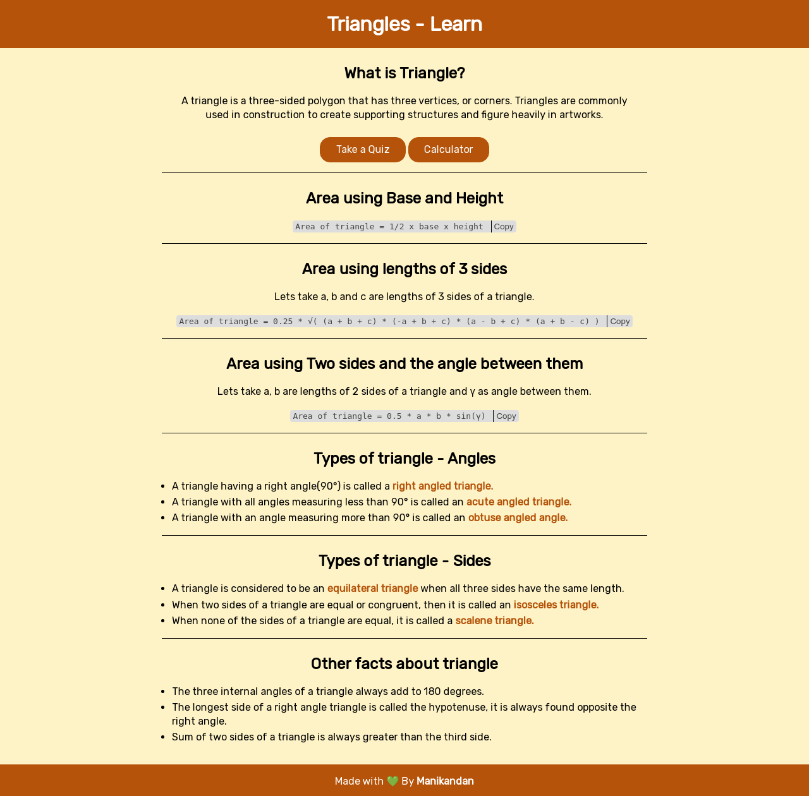

# learn_about_triangle_in_simplified_manner

### Overview
This is an vanila js app where you can  learn about triangle, take a quiz about triangle and Calulate area,hypotenose of triangle.

### Screenshot

### Link
[Live demo](https://learn-triangles-simplified.netlify.app/)

### Bulid with
 - Html
 - CSS
 - Javascript
 - Responsive

### What I learned.

- In this project I have learned and implemented the 'copy to clipboard' functionality for code tag.
- This project helped me to play with operators and form fields.
- I have also learned about using decimal value in min, max and step atribute in input tag.

### Author

- Website - [Manikandan](https://manikandan.netlify.app/)
- Twitter - [@_manismk](https://www.twitter.com/_manismk)

